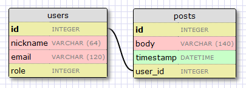
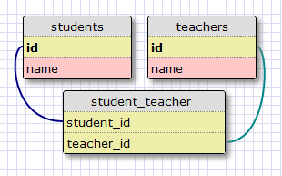
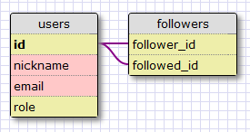

.. _followers:

关注者，联系人和好友
=====================

回顾
--------

我们小型的 *microblog* 应用程序已经慢慢变大，到现在为止我们已经接触了需要完成应用程序的大部分的话题。

今天我们将更加深入地学习数据库。我们应用程序的每一个用户都能够选择他或者她的关注者，因此我们的数据库必须能够记录谁关注了谁。所有的社交应用都会以某种形式实现这个功能。一些应用程序称它为联系人，其他连接，好友，伙伴或者关注者。其他的站点使用同样的主意去实现允许和忽略的用户列表。我们称它为关注者，尽管名字不同实现方式却是一样的。

‘关注者’ 特色的设计
--------------------

在编码之前，我们需要考虑下我们要从这个功能上得到些什么，换句话说，我们要实现些什么。

让我们先从最明显一个开始。我们想要用户容易地维护关注者的列表。

从另外一方面来看，对于每一个用户，我们想要知道他的或者她的关注者列表。

我们也想要有一种方式去查询用户是否被关注或者关注过其他用户。

用户点击任何用户的信息页上一个 “关注” 的链接就开始关注这个用户。否则，他们点击 “取消关注” 链接将会停止关注这个用户。

最后一个需求就是对于一个给定的用户，我们能够容易地查询数据库获取用户的被关注者的所有 blog。

所以，如果你认为这将是一个快速和容易的章节，请再想想！

数据库关系
-------------

我们说过我们想要有所有用户都拥有 “关注者” 和 “被关注者” 的列表。不幸地是，一个关系型数据库是没有 *list* 类型，我们有的是含有记录的表以及记录与记录之间的关系。

我们已经在数据库中有一个表来表示用户，所以剩下的就是找出适当的关系类型，它能模拟关注者/被关注者的链接。这是重新回顾三种数据关系类型的好时候:

一对多
^^^^^^^^^^^^^

在前面的章节中，我们已经见过一对多的关系。下面是这种关系的图表:

*users* 和 *posts* 是具有这种关系的两个表。我们说一个用户会有撰写多篇 blog，一篇 blog 会有一个撰写人。这种关系在数据库中的表示就是在 “多” 的这一边中使用了外键。在上面的例子中外键就是 *posts* 表中的 *user_id*。 这个字段把每一篇 blog 链接到用户表的作者的数据记录上。

*user_id* 字段提供了到给定 blog 作者的直接入口，然而相反的情况了？因为关系是很有作用的，我们应该能够得到一个给定的用户所撰写的 blog 列表。原来在 *posts* 表中 *user_id* 字段是足够能够回答这个问题，因为数据库有高效的查询索引允许我们查询类似 “获取用户 user_id 为 X 的所有的 blog” 的操作。

多对多
^^^^^^^^^^^^^

多对多的关系是有些复杂。例如，考虑一个数据库有 *students* 以及 *teachers*。我们可以说一个学生会有很多个老师，以及一个老师下也有多个学生。这就像两端(学生和老师)都是一对多的关系。

对于这种类型的关系，我们应该能够查询数据库获取在一个 *teachers* 类中教某一个学生的老师列表，以及一个老师下所有教的学生的列表。表示上述关系是相当棘手的，它不能简单地在已存在的表中添加外键。

这种多对多的关系的表示需要一个额外的称为关联表的辅助表。下面是数据库如何表示学生和教师的关系的例子：

虽然它可能不会看起来很简单，两个外键的关联表能够有效地回答很多种类的查询，如：

* 哪些老师教学生 S？
* 哪些学生是老师 T 教的？
* 老师 T 有多少个学生？
* 学生 S 有多少个老师？
* 老师 T 正在教学生 S 吗？
* 学生 S 在老师 T 的类里吗？

一对一
^^^^^^^^^^^^^

一对一的关系是一对多关系的一种特殊情况。表示方式是类似的，但是限制是添加到数据库中为了禁止 “多” 的这一边有一个以上的链接。

虽然某些情况下，这种类型的关系是有用的，它对其他两种类型来说是不常用，因为任何时候一个表的一个记录映射到另外一个表中的一个记录，可以说把两个表合并成一个更有意义。

表示关注者和被关注者
------------------------

从上面讲述到关系来说，我们很容易地决定最合适的模型是多对多的关系，因为一个用户可以关注多个其他的用户，同样一个用户可以被其他多个用户关注。但是这有一个问题。我们想要表示用户关注其他用户，因为我们只有用户。我们应该使用什么作为多对多关系的第二个表(实体)？

好的，这种关系的第二个表(实体)也是用户。如果一个表是指向自己的关系叫做 *自我指向* 关系，这就是我们现在需要的。

下面是多对多关系的图:

*followers* 表示我们的关联表。外键都是来自于用户表中，因为我们是用户连接到用户。在这个表中的每一个记录都是表示关注的用户以及被关注的用户的连接。像学生和老师的例子，像这样的一个设置允许回答所有我们将需要的关注者以及被关注者的问题。

数据模型
-----------

我们数据库的改变不是很大。我们首先开始添加 *followers* 表(文件 *app/models.py*)::

    followers = db.Table('followers',
        db.Column('follower_id', db.Integer, db.ForeignKey('user.id')),
        db.Column('followed_id', db.Integer, db.ForeignKey('user.id'))
    )

这是对上面图表上的关系表的直接翻译。注意我们并没有像对 *users* 和 *posts* 一样把它声明为一个模式。因为这是一个辅助表，我们使用 flask-sqlalchemy 中的低级的 APIs 来创建没有使用关联模式。

接着我们在 *users* 表中定义一个多对多的关系::

    class User(db.Model):
        id = db.Column(db.Integer, primary_key = True)
        nickname = db.Column(db.String(64), unique = True)
        email = db.Column(db.String(120), index = True, unique = True)
        role = db.Column(db.SmallInteger, default = ROLE_USER)
        posts = db.relationship('Post', backref = 'author', lazy = 'dynamic')
        about_me = db.Column(db.String(140))
        last_seen = db.Column(db.DateTime)
        followed = db.relationship('User', 
            secondary = followers, 
            primaryjoin = (followers.c.follower_id == id), 
            secondaryjoin = (followers.c.followed_id == id), 
            backref = db.backref('followers', lazy = 'dynamic'), 
            lazy = 'dynamic')

关系的设置不是很简单，需要一些解释。像我们在前面章节设置一对多关系一样，我们使用了 *db.relationship* 函数来定义关系。我们将连接 *User* 实例到其它 *User* 实例，换一种通俗的话来说，在这种关系下连接的一对用户，左边的用户是关注着右边的用户。因为我们定义左边的用户为 *followed*，当我们从左边用户查询这种关系的时候，我们将会得到被关注用户的列表。让我们一个一个来解释下 *db.relationship()* 中的所有参数：

* *'User'* 是这种关系中的右边的表(实体)(左边的表/实体是父类)。因为定义一个自我指向的关系，我们在两边使用同样的类。
* *secondary* 指明了用于这种关系的辅助表。
* *primaryjoin* 表示辅助表中连接左边实体(发起关注的用户)的条件。注意因为 *followers* 表不是一个模式，获得字段名的语法有些怪异。
* *secondaryjoin* 表示辅助表中连接右边实体(被关注的用户)的条件。
* *backref* 定义这种关系将如何从右边实体进行访问。当我们做出一个名为 *followed* 的查询的时候，将会返回所有跟左边实体联系的右边的用户。当我们做出一个名为 *followers* 的查询的时候，将会返回一个所有跟右边联系的左边的用户。*lazy* 指明了查询的模式。*dynamic* 模式表示直到有特定的请求才会运行查询，这是对性能有很好的考虑。
* *lazy* 是与 *backref* 中的同样名称的参数作用是类似的，但是这个是应用于常规查询。

如果上面的解释很难理解的话，没有关系。我们会在后面使用这些查询，一切就会明了。

因为我们对数据库做出了修改，现在我们必须生成一个新的迁移脚本::

    ./db_migrate.py

添加和移除 ‘关注者’
-----------------------

为了使得代码具有可重用性，我们将会在 *User* 模型中实现 *follow* 和 *unfollow* 函数，而不是在视图函数中。这种方式不仅可以让这个功能应用于真实的应用也能在单元测试中测试。原则上，从视图函数中移除应用程序的逻辑到数据模型中是一种好的方式。你们必须要保证视图函数尽可能简单，因为它能难被自动化测试。

下面是添加了添加和移除 ‘关注者’ 功能的 *User* 模型(文件 *app/models.py*)::

    class User(db.Model):
        #...
        def follow(self, user):
            if not self.is_following(user):
                self.followed.append(user)
                return self

        def unfollow(self, user):
            if self.is_following(user):
                self.followed.remove(user)
                return self

        def is_following(self, user):
            return self.followed.filter(followers.c.followed_id == user.id).count() > 0

上面这些方法是很简单了，多亏了 sqlalchemy 在底层做了很多的工作。我们只是从 *followed* 关系中添加或者移除了表项，sqlalchemy 为我们管理辅助表。

*follow* 和 *unfollow* 方法是定义成当它们成功的话返回一个对象或者失败的时候返回 *None*。当返回一个对象的时候，这个对象必须被添加到数据库并且提交。

*is_following* 方法在一行代码中做了很多。我们做了一个 *followed* 关系查询，这个查询返回所有当前用户作为关注者的 *(follower, followed)* 对。

测试
---------

让我们编写单元测试框架来检验目前我们已经写好的代码(文件 *tests.py*)::

    class TestCase(unittest.TestCase):
        #...
        def test_follow(self):
            u1 = User(nickname = 'john', email = 'john@example.com')
            u2 = User(nickname = 'susan', email = 'susan@example.com')
            db.session.add(u1)
            db.session.add(u2)
            db.session.commit()
            assert u1.unfollow(u2) == None
            u = u1.follow(u2)
            db.session.add(u)
            db.session.commit()
            assert u1.follow(u2) == None
            assert u1.is_following(u2)
            assert u1.followed.count() == 1
            assert u1.followed.first().nickname == 'susan'
            assert u2.followers.count() == 1
            assert u2.followers.first().nickname == 'john'
            u = u1.unfollow(u2)
            assert u != None
            db.session.add(u)
            db.session.commit()
            assert u1.is_following(u2) == False
            assert u1.followed.count() == 0
            assert u2.followers.count() == 0

通过执行下面的命令来运行这个测试::

    ./tests.py

数据库查询
--------------

我们的数据库模型已经能够支持大部分我们列出来的需求。我们缺少的实际上是最难的。我们的首页将会显示登录用户所有关注者撰写的 blog，因为我们需要一个返回这些 blog 的查询。

最明了的解决方式就是查询给定的关注者用户的列表，这也是我们目前可以做到的。接着对每一个返回的用户去查询他的或者她的 blog。一旦我们完成所有的查询工作，我们把它们整合到一个列表中然后排序。听起来不错？实际上不是。

这种方法其实问题很大。当一个用户拥有上千个关注者的话会发生些什么？我们需要执行上千次甚至更多的数据库查询，并且在内存中我们需要维持一个数据量很大的 blog 的列表，接着还要排序。不知道这些做完，要花上多久的时间？

这种收集以及排序的工作需要在其它的地方完成，我们只要使用结果就行。这类的工作其实就是关系型数据库擅长。数据库有索引，因此允许以一种高效地方式去查询以及排序。

所以我们真正想要的是要拿出一个单一的数据库查询，表示我们想要得到什么样的信息，然后我们让数据库弄清楚什么是最有效的方式来为我们获取数据。

下面这种查询可以实现上述的要求，这个单行的代码又被我们添加到 *User* 模型(文件 *app/models.py*)::

    class User(db.Model):
        #...
        def followed_posts(self):
            return Post.query.join(followers, (followers.c.followed_id == Post.user_id)).filter(followers.c.follower_id == self.id).order_by(Post.timestamp.desc())

让我们来分解这个查询。它一共有三部分:连接，过滤以及排序。

连接
^^^^^^^^

为了理解一个连接操作做了什么，让我们看看例子。假设我们有一个如下内容的 *User* 表:

.. image:: images/2.jpg

只为了简化例子，表里面还有一些额外的字段没有显示。

比如说，我们的 *followers* 辅助表中表示用户 “john” 关注着 用户 “susan” 以及 “david”，用户 “susan” 关注着 “mary” 以及 用户 “mary” 关注着 “david”。表示上述的数据是这样的：

.. image:: images/3.jpg

最后，我们的 *Post* 表中，每一个用户有一篇 blog：

.. image:: images/4.jpg

这里再次申明为了使得例子显得简单，我们忽略了一些字段。

下面是我们的查询的连接部分的，独立于其余的查询::

    Post.query.join(followers, 
        (followers.c.followed_id == Post.user_id))

在 *Post* 表中调用了 *join* 操作。这里有两个参数，第一个是其它的表，我们的 *followers* 表。第二参数就是连接的条件。

连接操作所做的就是创建一个数据来自于 *Post* 和 *followers* 表的临时新的表，根据给定条件进行整合。

在这个例子中，我们要 *followers* 表中的字段 *followed_id* 与 *Post* 表中的字段 *user_id* 相匹配。

为了演示整合的过程，我们从 *Post* 表中取出所有记录，从 *followers* 表中取出符合条件的记录插入在后边。如果没有匹配的话，*Post* 表中的记录就会被移除。

我们例子中这个临时表的连接的结果如下:

.. image:: images/5.jpg

注意 *Post* 表中的 *user_id=1* 记录被移除了，因为在 *followers* 表中没有 *followed_id=1* 的记录。

过滤
^^^^^^^^

连接操作给我们被某人关注的用户的 blog 的列表，但是没有指出谁是关注者。我们仅仅对这个列表的子集感兴趣，我们只需要被某一特定用户关注的用户的 blog 列表。

因此我们过滤这个表格，查询的过滤操作是::

    filter(followers.c.follower_id == self.id)

注意查询是在我们目标用户的内容中执行，因为这是 *User* 类的一个方法，*self.id* 就是我们感兴趣的用户的 id。因此在我们的例子中，如果我们感兴趣的用户的 id 是 *id=1*，那么我们会得到另一个临时表:

.. image:: images/6.jpg

这就是我们要的 blog。请注意查询是关注在 *Post* 类，因此即使我们得到一个不符合我们任何一个数据库模型的临时表，结果还是包含在这个临时表中的 blog。

排序
^^^^^^^^
 
最后一步就是根据我们的规则对结果进行排序。排序操作如下::

    order_by(Post.timestamp.desc())

在这里，我们要说的结果应该按照 timestamp 字段按降序排列，这样的第一个结果将是最近的 blog。

这里还有一个小问题需要我们改善我们的查询操作。当用户阅读他们关注者的 blog 的时候，他们可能也想看到自己的 blog。因此最好把用户自己的 blog 也包含进查询结果中。

其实这不需要做任何改变。我们只需要把自己添加为自己的关注者。

为了结束我们长时间的查询操作的讨论，让我们为我们查询写些单元测试(文件 *tests.py*)::

    #...
    from datetime import datetime, timedelta
    from app.models import User, Post
    #...
    class TestCase(unittest.TestCase):
        #...
        def test_follow_posts(self):
            # make four users
            u1 = User(nickname = 'john', email = 'john@example.com')
            u2 = User(nickname = 'susan', email = 'susan@example.com')
            u3 = User(nickname = 'mary', email = 'mary@example.com')
            u4 = User(nickname = 'david', email = 'david@example.com')
            db.session.add(u1)
            db.session.add(u2)
            db.session.add(u3)
            db.session.add(u4)
            # make four posts
            utcnow = datetime.utcnow()
            p1 = Post(body = "post from john", author = u1, timestamp = utcnow + timedelta(seconds = 1))
            p2 = Post(body = "post from susan", author = u2, timestamp = utcnow + timedelta(seconds = 2))
            p3 = Post(body = "post from mary", author = u3, timestamp = utcnow + timedelta(seconds = 3))
            p4 = Post(body = "post from david", author = u4, timestamp = utcnow + timedelta(seconds = 4))
            db.session.add(p1)
            db.session.add(p2)
            db.session.add(p3)
            db.session.add(p4)
            db.session.commit()
            # setup the followers
            u1.follow(u1) # john follows himself
            u1.follow(u2) # john follows susan
            u1.follow(u4) # john follows david
            u2.follow(u2) # susan follows herself
            u2.follow(u3) # susan follows mary
            u3.follow(u3) # mary follows herself
            u3.follow(u4) # mary follows david
            u4.follow(u4) # david follows himself
            db.session.add(u1)
            db.session.add(u2)
            db.session.add(u3)
            db.session.add(u4)
            db.session.commit()
            # check the followed posts of each user
            f1 = u1.followed_posts().all()
            f2 = u2.followed_posts().all()
            f3 = u3.followed_posts().all()
            f4 = u4.followed_posts().all()
            assert len(f1) == 3
            assert len(f2) == 2
            assert len(f3) == 2
            assert len(f4) == 1
            assert f1 == [p4, p2, p1]
            assert f2 == [p3, p2]
            assert f3 == [p4, p3]
            assert f4 == [p4]

可能的改进
--------------

我们现在已经实现 ‘follower’ 功能所需要的内容，但是还能改进我们的设计使得变得更加合理。

所有的社会网络，我们对这种连接其它用户的功能是又爱又恨，但他们有更多的选择来控制信息的共享。

例如，我们没有权利拒绝别人的关注。这将要花费很大的底层代码用于查询，因为我们不仅仅需要查询到我们所关注的用户的 blog，而且还要过滤掉拒绝关注的用户的 blog。怎么实现这种需求了？简单，新增一个多对多的自我指向关系用来记录谁拒绝谁的关注，接着一个新的连接+过滤的查询用来返回这些 blog。

社交网络中另一个流行的特色就是能够定制关注者的分组，仅仅共享某些分组的内容。这也是能够通过添加额外的关系以及复杂的查询来实现。

我们不打算把这些加入到我们的 *microblog*，但是如果大家都感兴趣的话，我将会就此话题新写一章节。

收尾
------

今天我们已经取得了巨大的进步。尽管我们已经解决了所有的问题，但是有关数据库的设置和查询，我们还没有在应用程序中启用的这些新功能。

幸运地是，这些不存在什么挑战。我们只需要修改下视图函数和模版，因此让我们完成最后的部分来结束这一章节吧。

成为自己的关注者
^^^^^^^^^^^^^^^^^^^^^

我们已经决定用户可以关注所有的用户，因此我们可以关注自己。

我们决定在 *after_login* 中处理 OpenID 的时候就设置自己成为自己的关注者(文件 *app/views.py*)::

    @oid.after_login
    def after_login(resp):
        if resp.email is None or resp.email == "":
            flash('Invalid login. Please try again.')
            redirect(url_for('login'))
        user = User.query.filter_by(email = resp.email).first()
        if user is None:
            nickname = resp.nickname
            if nickname is None or nickname == "":
                nickname = resp.email.split('@')[0]
            nickname = User.make_unique_nickname(nickname)
            user = User(nickname = nickname, email = resp.email, role = ROLE_USER)
            db.session.add(user)
            db.session.commit()
            # make the user follow him/herself
            db.session.add(user.follow(user))
            db.session.commit()
        remember_me = False
        if 'remember_me' in session:
            remember_me = session['remember_me']
            session.pop('remember_me', None)
        login_user(user, remember = remember_me)
        return redirect(request.args.get('next') or url_for('index'))

关注以及取消关注的链接
^^^^^^^^^^^^^^^^^^^^^^^^^^^

接着，我们将会定义关注以及取消关注用户的视图函数(文件 *app/views.py*)::

    @app.route('/follow/<nickname>')
    def follow(nickname):
        user = User.query.filter_by(nickname = nickname).first()
        if user == None:
            flash('User ' + nickname + ' not found.')
            return redirect(url_for('index'))
        if user == g.user:
            flash('You can\'t follow yourself!')
            return redirect(url_for('user', nickname = nickname))
        u = g.user.follow(user)
        if u is None:
            flash('Cannot follow ' + nickname + '.')
            return redirect(url_for('user', nickname = nickname))
        db.session.add(u)
        db.session.commit()
        flash('You are now following ' + nickname + '!')
        return redirect(url_for('user', nickname = nickname))

    @app.route('/unfollow/<nickname>')
    def unfollow(nickname):
        user = User.query.filter_by(nickname = nickname).first()
        if user == None:
            flash('User ' + nickname + ' not found.')
            return redirect(url_for('index'))
        if user == g.user:
            flash('You can\'t unfollow yourself!')
            return redirect(url_for('user', nickname = nickname))
        u = g.user.unfollow(user)
        if u is None:
            flash('Cannot unfollow ' + nickname + '.')
            return redirect(url_for('user', nickname = nickname))
        db.session.add(u)
        db.session.commit()
        flash('You have stopped following ' + nickname + '.')
        return redirect(url_for('user', nickname = nickname))

这里应该不需要做过多的解释，但是需要注意的是检查周围的错误，为了防止期望之外的错误，试着给用户提供信息并且重定向到合适的位置当错误发生的时候。

最后需要修改下模版(文件 *app/templates/user.html*)::

    <!-- extend base layout -->
    

    
    <table>
        <tr valign="top">
            <td></td>
            <td>
                <h1>User: {{user.nickname}}</h1>
                
{{user.about_me}}

                
<i>Last seen on: {{user.last_seen}}</i>

                
{{user.followers.count()}} followers | 
                
                    <a href="{{url_for('edit')}}">Edit your profile</a>
                
                    <a href="{{url_for('follow', nickname = user.nickname)}}">Follow</a>
                
                    <a href="{{url_for('unfollow', nickname = user.nickname)}}">Unfollow</a>
                
                

            </td>
        </tr>
    </table>
    

    
        
    
    

在编辑一行上，我们会显示关注者的用户数目，后面可能会跟随三种可能的链接:

* 如果用户属于登录状态，“编辑” 链接会显示。
* 否则，如果用户不是关注者，“关注” 链接会显示。
* 否则，一个 “取消关注” 将会显示。

这个时候你可以运行应用程序，创建一些用户，试试关注以及取消关注用户。

最后剩下的就是 *index* 页，但是现在还不是完成的时候，我们会在下一章完成它。

结束语
-----------

今天的话题涉及到数据库关系以及查询，所以可能有些复杂。不用着急，慢慢的消化。

如果你想要节省时间的话，你可以下载 `microblog-0.8.zip <https://github.com/miguelgrinberg/microblog/archive/v0.8.zip>`_。

我希望能在下一章继续见到各位！