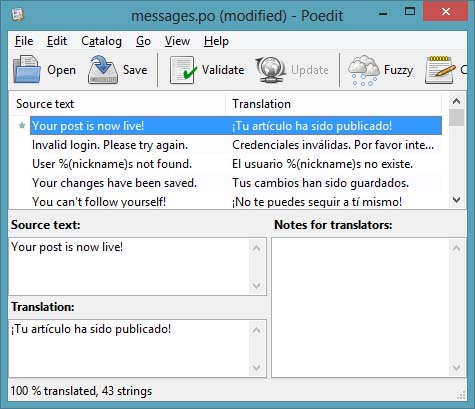

.. _i18n:

国际化和本地化
==================

今天的文章的主题是国际化和本地化，通常简称 I18n 和 L10n。我们想要我们的 *microblog* 应用程序被尽可能多的用户使用，因为我们不能忘记有许多人是不是讲英文的，或者会说英文，但是更愿意讲本国语言。

为了使得我们的应用程序便于外国访问者，我们将要使用 `Flask-Babel <http://packages.python.org/Flask-Babel/>`_ 扩展，它提供了一种简单使用的框架用来把应用程序翻译成不用的应用。

如果你还没有安装 Flask-Babel，现在是时候安装。对于 Linux 和 Mac 用户::

    flask/bin/pip install flask-babel

对于 Windows 用户::

    flask\Scripts\pip install flask-babel

配置
---------

Flask-Babel 可以简单地通过创建 *Babel* 类的一个实例并且传入 Flask 应用对象给它来初始化(文件 *app/__init__.py*)::

    from flask.ext.babel import Babel
    babel = Babel(app)

我们也需要决定我们将要提供翻译的语言种类。现在我们将要开始一个西班牙版本，因为我们有一个西语的翻译器在手上，以后添加其它语言的版本也是很容易的。支持语言的列表被添加到配置文件中(文件 *config.py*)::

    # -*- coding: utf-8 -*-
    # ...
    # available languages
    LANGUAGES = {
        'en': 'English',
        'es': 'Español'
    }

*LANGUAGES* 字典有可用语言代码的键，以及可打印的语言名称作为值。我们使用短的语言代码，但是要指明语言和地域的话，也可能使用长代码。比如，如果我们要支持美国和英国英语的话，我们的字典里面可以有 *'en-US'* 和 *'en-GB'*。

注意因为 *Español* 有一个外来字符，我们必须在 Python 源代码文件顶部中添加 *coding* 声明，告诉 Python 解释器我们是使用 `UTF-8 编码 <http://en.wikipedia.org/wiki/UTF-8>`_ 不是 ASCII，因为 ASCII 编码缺少 *ñ* 字符。

接下来的一个配置就是我们需要一个 *Babel* 用于决定使用哪种语言的函数(文件 *app/views.py*)::

    from app import babel
    from config import LANGUAGES

    @babel.localeselector
    def get_locale():
        return request.accept_languages.best_match(LANGUAGES.keys())

这个函数有一个 *localeselector* 装饰器，它被调用在请求之前为了当产生响应的时候给我们机会选择使用的语言。现在为止我们做的是简单的，我们只要读取浏览器发送的 HTTP 请求中的 *Accept-Languages* 头并且从我们支持的语言列表中选择最匹配的语言。这个过程实际上也相当简单，*best_match* 方法为我们做了所有工作。

*Accept-Languages* 头在大多数浏览器上被默认配置成操作系统层的所选择的语言，但是所有的浏览器给我们机会选择其它的语言。用户可以提供语言列表，每一个都有权重。作为例子，下面是复杂的 *Accept-Languages* 头::

    Accept-Language: da, en-gb;q=0.8, en;q=0.7

上面的头信息表示最佳的语言是丹麦语(默认权重为 1)，接着是英国英语(权重是 0.8)以及最后一个选项是通用英语(权重是 0.7)。

最后一项配置是我们需要一个 Babel 配置文件，它告诉 Babel 在我们代码和模板中的哪里去寻找翻译的文本(文件 *babel.cfg*)::

    [python: **.py]
    [jinja2: **/templates/**.html]
    extensions=jinja2.ext.autoescape,jinja2.ext.with_

最前面的两行告诉 Babel 我们的 Python 代码以及模版的文件名模式。第三行是告诉 Babel 启用一些扩展使得它能够在 Jinja2 模版中寻找翻译的文本。

标记翻译文本
----------------

现在到了这个任务最繁琐的地方。我们需要检查所有的代码和模版标记所有需要翻译的英文文本以便 Babel 能够找到它们。例如，看看从 *after_login* 函数中代码片段::

    if resp.email is None or resp.email == "":
        flash('Invalid login. Please try again.')
        redirect(url_for('login'))

这里有一个闪现消息需要翻译。为了使得 Babel 知道这个文本，只要把这个字符串传入到 *gettext* 函数::

    from flask.ext.babel import gettext
    # ...
    if resp.email is None or resp.email == "":
        flash(gettext('Invalid login. Please try again.'))
        redirect(url_for('login'))

在模板中我们必须做一些类似的工作，但是我们使用 *_()* 来简化 *gettext()*。比如，在我们基础模版中的链接的文本 *Home*::

    <li><a href="{{ url_for('index') }}">Home</a></li>

能够被标记翻译如下::

    <li><a href="{{ url_for('index') }}">{{ _('Home') }}</a></li>

不幸地是，不是所有我们要翻译的文本像上面一样的简单。作为一个例子，考虑下来自我们的 *post.html* 子模板中的如下的片段::

    
<a href="{{url_for('user', nickname = post.author.nickname)}}">{{post.author.nickname}}</a> said {{momentjs(post.timestamp).fromNow()}}:

这里我们要翻译的结构式：“*<nickname>* 说 *<when>*:”。一种尝试就是只标记翻译 “说”，因为我们不确定在这一句中姓名以及时间组合的次序在所有语言中是一样的。正确的办法是标记整个语句并且使用对姓名与时间使用占位符，这样翻译器会在必要的时候改变次序。更复的杂情况是，名称里面内嵌了一个超链接。

*gettext* 函数是支持使用 *%(name)s* 语法占位符，这也是我们最好的解决办法。下面是一个类似情况的占位符的例子::

    gettext('Hello, %(name)s', name = user.nickname)

回到我们的例子，这里是怎样标记文本翻译::

    
    
{{ _('%(nickname)s said %(when)s:', nickname = '<a href="%s">%s</a>' % (url_for('user', nickname = post.author.nickname), post.author.nickname), when = momentjs(post.timestamp).fromNow()) }}

    

因为我们在 *nickname* 占位符上放入了 HTML，我们需要关闭自动转义。但是关闭自动转义是一个很冒险的行为，渲染用户的输入并且不进行转义是很不安全的。

赋值给 *when* 占位符的文本是安全的，因为它是我们的 *momentjs()* 封装函数生成的文本。但是 *nickname* 占位符的文本是来自我们 *User* 模型中的 *nickname* 字段，这是来自数据库中并且完全由用户输入。如果用户在这个字段中输入特定意义的 HTML 或者 Javascript 脚本，我们没有对这些进行转义，可能我们会执行这些代码，这也许是一个后门。我们不能允许这样的事情，因此我们需要避免这种情况。

最有效的解决方案就是对 *nickname* 字段中使用的字符进行严格的限制。我们开始创建一个函数转换一个无效的 *nickname* 成一个有效(文件 *app/models.py*)::

    import re

    class User(db.Model):
        #...
        @staticmethod
        def make_valid_nickname(nickname):
            return re.sub('[^a-zA-Z0-9_\.]', '', nickname)

这里我们只是从 *nickname* 字段中移除非字母，数字，.，_ 的字符。

当一个用户在页面注册，我们从 OpenID 提供商接收到他或者她的 *nickname*，因此我们必须确保转换这个 *nickname* (文件 *app/views.py*)::

    @oid.after_login
    def after_login(resp):
        #...
        nickname = User.make_valid_nickname(nickname)
        nickname = User.make_unique_nickname(nickname)
        user = User(nickname = nickname, email = resp.email, role = ROLE_USER)
        #...

同样在编辑用户信息的表单中，那里可以修改 *nickname*，我们需要在那里加强验证不允许非法字符(文件 *app/forms.py*)::

    class EditForm(Form):
        #...
        def validate(self):
            if not Form.validate(self):
                return False
            if self.nickname.data == self.original_nickname:
                return True
            if self.nickname.data != User.make_valid_nickname(self.nickname.data):
                self.nickname.errors.append(gettext('This nickname has invalid characters. Please use letters, numbers, dots and underscores only.'))
                return False
            user = User.query.filter_by(nickname = self.nickname.data).first()
            if user != None:
                self.nickname.errors.append(gettext('This nickname is already in use. Please choose another one.'))
                return False
            return True

提取文本翻译
---------------

这里我不会列举所有需要翻译的代码和模版。感兴趣的读者可以检查 `这里 <https://github.com/miguelgrinberg/microblog/commit/cac572cb0e427654edd3ac599f6197f1f6ee29f6>`_。

因此让我们假设我们已经发现所有文本并且把它们放入了 *gettext()* 或者 *_()* 调用中。那现在要干什么了？

现在我们运行 *pybabel* 提取文本到单独的文件中::

    flask/bin/pybabel extract -F babel.cfg -o messages.pot app

Windows 用户使用这个命令::

    flask\Scripts\pybabel extract -F babel.cfg -o messages.pot app

*pybabel extract* 命令会读取给定的配置文件，接着扫描在给定参数(在我们的例子中为 *app*)目录下的所有的代码和模版，当它发现标记翻译的文本就会把它拷贝到 *messages.pot* 文件。

*messages.pot* 文件是一个模板文件，其中包含所有需要翻译的文本。这个文件是用来作为一种生成语言文件的模型。

生成一个语言目录
------------------

这个过程的下一步就是为一个新语言创建翻译。我们说过我们要做西班牙版本(语言代码为 *es*)，因此这是添加西班牙语到我们应用程序的命令::

    flask/bin/pybabel init -i messages.pot -d app/translations -l es

*pybabel init* 命令把 *.pot* 文件作为输入，生成一个新语言目录，以 *-d* 选项指定的目录为新语言的目录，以 *-l* 指定的语言为想要翻译成的语言类型。默认情况下，Babel 希望翻译的语言在与模版相同目录级别的 *translations* 文件夹中，因此我们把它们放在这里。

在你运行上述命令后，一个目录 *app/translations/es* 是创建了。在它里面有另一个名为 *LC_MESSAGES* 的目录，在它里面有一个 *messages.po* 文件。

下面就是翻译成西班牙语的截图:

一旦文本翻译完成并且保存成 *messages.po* 文件，还有另外一个来发布这些文本::

    flask/bin/pybabel compile -d app/translations

*pybabel compile* 这一步会读取 *.po* 文件的内容并且会在相同的目录下生成一个名为 *.mo* 的编译的版本。这个文件以一种优化的格式包含了翻译的文本，应用程序可以更高效地使用它。

翻译已经准备好被使用了。为了验证它你可以修改浏览器上的语言设置让西班牙语为最佳语言，或者你可以直接修改 *get_locale* 函数(文件 *app/views.py*)::

    @babel.localeselector
    def get_locale():
        return "es" #request.accept_languages.best_match(LANGUAGES.keys())

更新翻译
-----------

如果 *messages.po* 文件不完整会发生些什么，比如某些文本忘记了翻译？不会发生什么异常，应用程序会运行的好好的，只是这些文本不会被翻译继续显示成英文。

如果在我们的代码或者模版中丢失了一些英文文本的话会发生些什么？任何没有放入 *gettext()* 或者 *_()* 的字符串都不会在翻译文件中，因此 Babel 不会感知这些，它们依然保持英文。一旦我们把丢失的文本添加进 *gettext()*，运行如下命令可以升级翻译文件::

    flask/bin/pybabel extract -F babel.cfg -o messages.pot app
    flask/bin/pybabel update -i messages.pot -d app/translations

*extract* 命令与前面用过的是一样的，它只是生成一个更新的 *messages.pot* 文件，文件里添加了新的文本。*update* 调用会把更新的文件加入到所有翻译的语言中。

一旦每一个语言文件夹的 *messages.po* 文件被更新了，我们可以运行 *poedit* 查看更新的文本，接着重复 *pybabel compile* 命令使得新的文本对应用程序可用。

翻译 *moment.js*
----------------------

目前为止，代码以及模版中的文本都已经翻译成西班牙版本，可以运行应用程序看看。

但是此时我们会发现时间戳仍然是英语的。我们使用的渲染日期和时间的 *moment.js* 没有并通知到需要一个不同语言的版本。

从 *moment.js* 的 `文档 <http://momentjs.com/docs/#/i18n/loading-into-browser/>`_ 我们发现 *moment.js* 有多语言版本可用。因此我们下载了西班牙语版本的 *moment.js*，并把它放在 *static/js* 文件夹中命名为 *moment-es.min.js*。我们将会按照这种方式，把不同语言的 *moment.js* 以 *moment-<language>.min.js* 形式存入 *static/js* 中，以便以后我们可以自动地选择正确的版本。

为了能够在模版中加载正确语言版本的 *moment.js*，我们需要把语言的代码加入到 Flask 全局变量，跟记录登录用户是相同的方式(文件 *app/views.py*)::

    @app.before_request
    def before_request():
        g.user = current_user
        if g.user.is_authenticated():
            g.user.last_seen = datetime.utcnow()
            db.session.add(g.user)
            db.session.commit()
            g.search_form = SearchForm()
        g.locale = get_locale()

接着需要在基础模版中修改引用 *moment.js* 的代码(文件 *app/templates/base.html*)::

    
    
    

惰性求值
-----------

当我们继续把玩着我们的西班牙语版本的应用程序，发现了一个问题。当我们登出并且尝试重新登录的时候，出现一个英语的闪现消息 “请登录后访问本页。” 。这是哪里的消息？我们并没有加入这个消息，它是 Flask-Login 扩展做的。

Flask-Login 允许用户配置这个消息，因此我们要充分利用不会改变消息只是翻译这一点。因此，我们进行第一次尝试(文件 *app/__init__.py*)::

    from flask.ext.babel import gettext
    lm.login_message = gettext('Please log in to access this page.')

但是它并不工作。*gettext* 必须在请求的内容中使用才会产生翻译信息。如果我们在请求之外的地方使用，它不会翻译只会给我们英语版本的默认文本。

幸好，*Flask-Babel* 提供另外一个函数 *lazy_gettext*，它不会像 *gettext()* 和 *_()* 一样立即翻译，相反它会推迟翻译直到字符串实际上被使用的时候才会翻译。这个函数就可以应用到这里::

    from flask.ext.babel import lazy_gettext
    lm.login_message = lazy_gettext('Please log in to access this page.')

最后，当使用 *lazy_gettext* 的时候，*pybabel extract* 命令需要一个额外的 *-k* 的选项指明是 *lazy_gettext* 函数::

    flask/bin/pybabel extract -F babel.cfg -k lazy_gettext -o messages.pot app

接下来的事情就跟上面更新翻译一样。依次 *pybabel update*，*poedit*，*pybabel compile*。

快捷方式
-----------

因为 *pybabel* 命令是又长又难记，我们可以编写一个快速的以及干净的小脚本来替代前面我们使用的命令。

第一个脚本就是添加语言到翻译目录(文件 *tr_init.py*)::

    #!flask/bin/python
    import os
    import sys
    if sys.platform == 'wn32':
        pybabel = 'flask\\Scripts\\pybabel'
    else:
        pybabel = 'flask/bin/pybabel'
    if len(sys.argv) != 2:
        print "usage: tr_init <language-code>"
        sys.exit(1)
    os.system(pybabel + ' extract -F babel.cfg -k lazy_gettext -o messages.pot app')
    os.system(pybabel + ' init -i messages.pot -d app/translations -l ' + sys.argv[1])
    os.unlink('messages.pot')

接着一个脚本就是更新语言目录(文件 *tr_update.py*)::

    #!flask/bin/python
    import os
    import sys
    if sys.platform == 'wn32':
        pybabel = 'flask\\Scripts\\pybabel'
    else:
        pybabel = 'flask/bin/pybabel'
    os.system(pybabel + ' extract -F babel.cfg -k lazy_gettext -o messages.pot app')
    os.system(pybabel + ' update -i messages.pot -d app/translations')
    os.unlink('messages.pot')

最后，就是编译目录的脚本(文件 *tr_compile.py*)::

    #!flask/bin/python
    import os
    import sys
    if sys.platform == 'wn32':
        pybabel = 'flask\\Scripts\\pybabel'
    else:
        pybabel = 'flask/bin/pybabel'
    os.system(pybabel + ' compile -d app/translations')

这些脚本会让工作变得更加简单些！

结束语
--------

今天我们实现一个网页应用程序很容易忽略的东西。用户希望在本地语言下使用，因此必须让我们的应用程序支持多种语言。

在接下来的文章中，我们将看看可能是国际化和本地化最复杂的方面，就是用户产生的内容的实时自动翻译。我们将会利用这个机会给我们的应用程序添加些 Ajax 的魔力。

如果你想要节省时间的话，你可以下载 `microblog-0.14.zip <https://github.com/miguelgrinberg/microblog/archive/v0.14.zip>`_。

我希望能在下一章继续见到各位！