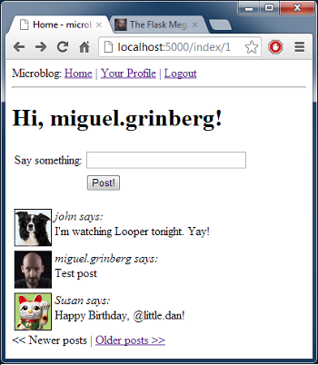

.. _pagination:

分页
========

回顾
------

在前面的章节(:ref:`followers`)，我们已经完成了所有支持 “关注者” 功能的数据库的修改。今天我们将会让我们应用程序接受用户的真实数据。我们将要告别伪造数据的时候！

我们接下来讲述的正是我们上一章离开的地方，所以你可能要确保应用程序 *microblog* 正确地安装和工作。

提交博客文章
---------------

让我们先以简单的内容开始，主页应该有一个提交新的 blog 的表单。

首先我们定义一个单字段的表单对象(文件 *app/forms.py*)::

    class PostForm(Form):
        post = TextField('post', validators = [Required()])

接着，我们把表单添加到模板中(文件 *app/templates/index.html*)::

    <!-- extend base layout -->
    

    
    <h1>Hi, {{g.user.nickname}}!</h1>
    <form action="" method="post" name="post">
        {{form.hidden_tag()}}
        <table>
            <tr>
                <td>Say something:</td>
                <td>{{ form.post(size = 30, maxlength = 140) }}</td>
                <td>
                
                [{{error}}] 
                
                </td>
            </tr>
            <tr>
                <td></td>
                <td><input type="submit" value="Post!"></td>
                <td></td>
            </tr>
        </table>
    </form>
    
    

      {{post.author.nickname}} says: <b>{{post.body}}</b>
    

    
    

到目前为止，内容没有什么解释的，都不是新的东西。我们只是简单的添加另外一个表单而已，跟我们之前做的一样。

最后，把这一切联系起来的视图函数需要被扩展用来处理表单(文件 *app/views.py*)::

    from forms import LoginForm, EditForm, PostForm
    from models import User, ROLE_USER, ROLE_ADMIN, Post

    @app.route('/', methods = ['GET', 'POST'])
    @app.route('/index', methods = ['GET', 'POST'])
    @login_required
    def index():
        form = PostForm()
        if form.validate_on_submit():
            post = Post(body = form.post.data, timestamp = datetime.utcnow(), author = g.user)
            db.session.add(post)
            db.session.commit()
            flash('Your post is now live!')
            return redirect(url_for('index'))
        posts = [
            { 
                'author': { 'nickname': 'John' }, 
                'body': 'Beautiful day in Portland!' 
            },
            { 
                'author': { 'nickname': 'Susan' }, 
                'body': 'The Avengers movie was so cool!' 
            }
        ]
        return render_template('index.html',
            title = 'Home',
            form = form,
            posts = posts)

让我们一个一个来回顾下这个函数的修改点:

* 导入 *Post* 和 *PostForm* 类
* 在与 *index* 视图函数相关联的两个路由上，我们接受 POST 请求，因为我们需要接受提交的 blog。
* 当接受常规的 GET 请求的时候我们像以前一样的处理。当我们接收到一个表单的提交的时候，我们在数据库中插入一个新的 *Post* 记录。
* 模板现在接受一个新的参数：*form*。

当我们在数据库中插入一个新的 *Post* 后，我们将会重定向到首页::

    return redirect(url_for('index')) 

我们这里可以轻松地跳过(不使用)重定向，允许函数继续到渲染模板的部分，这将会是更加高效的。因此，为什么需要重定向？考虑如果一个用户正在撰写 blog，接着不小心按到了浏览器的刷新键，会发生些什么。刷新的命令将会做些什么？浏览器将会重新发送上一次的请求作为刷新命令的结果。

没有重定向，上一次的请求是提交表单的 POST 请求，因此刷新动作将会重新提交表单，导致与第一个相同的第二个 *Post* 记录被写入数据库。这并不好。

有了重定向，我们迫使浏览器在表单提交后发送另外一个请求，即重定向页的请求。这是一个简单的 GET 请求，因此一个刷新动作将会重复 GET 请求而不是多次提交表单。

这个小技巧避免了用户在提交 blog 后不小心触发刷新的动作而导致插入重复的 blog。

显示 blog
----------

我们将要从数据库获取 blog，并展示它们。

如果你还记得前几篇文章中，我们创建了几个伪造的 blog，它们已经在我们主页上展示很长一段时间。在 *index* 视图函数这两个创建的伪造的对象是简单的 Python 列表::

    posts = [
        { 
            'author': { 'nickname': 'John' }, 
            'body': 'Beautiful day in Portland!' 
        },
        { 
            'author': { 'nickname': 'Susan' }, 
            'body': 'The Avengers movie was so cool!' 
        }
    ]

但是在上一章中我们已经创建了一个查询，它允许我们获取关注的用户的所有的 blog，因此我们简单地替换上面这些伪造的数据(文件 *app/views.py*)::

    posts = g.user.followed_posts().all()

当你运行应用程序的时候就会看到来自数据库中的 blog。

*User* 类中的 *followed_posts* 方法返回一个 sqlalchemy 查询对象，该查询对象用于获取我们感兴趣的 blog。在这个查询中调用 *all()* 只是为了检索所有的 blog 并形成一个列表，因此我们以一个与我们使用的伪造数据相似的结构结束。模版是不会注意到这一点的。

这个时候可以接着试试你的应用程序了。你可以创建一些用户，接着关注他们(她们)，最后发布些 blog。

分页
----------

应用程序看起来比任何时候都要好，但是还是有个问题。我们把所有关注者的 blog 展示在首页上。如果数量超过上千的话会发生些什么？或者上百万？你可以想象得到，处理如此大数据量的列表对象将会及其低效的。

相反，如果我们分组或者分页显示大量的 blog？效率和效果会不会好一些了？

Flask-SQLAlchemy 天生就支持分页。比如如果我们想要得到用户关注者的前三篇 blog，我们可以这样做::

    posts = g.user.followed_posts().paginate(1, 3, False).items

*paginate* 方法能够被任何查询调用。它接受三个参数:

* 页数，从 1 开始，
* 每一页的项目数，这里也就是说每一页显示的 blog 数，
* 错误标志。如果是 True，当请求的范围页超出范围的话，一个 404 错误将会自动地返回到客户端的网页浏览器。如果是 False，返回一个空列表而不是错误。

从 *paginate* 返回的值是一个 *Pagination* 对象。这个对象的 *items* 成员包含了请求页面项目(本文是指 blog)的列表。在 *Pagination* 对象中还有其它有帮助的东西，我们将在后面能看到。

现在让我们想想如何在我们的 *index* 视图函数中实现分页。我们首先在配置文件中添加一些决定每页显示的 blog 数的配置项(文件 *config.py*)::

    # pagination
    POSTS_PER_PAGE = 3

在最后的应用程序中我们当然会使用每页显示的 blog 数大于 3，但是测试的时候用小的数量更加方便。

接着，让我们看看不同页的 URLs 是什么样的。我们知道 Flask 路由可以携带参数，因此我们在 URL 后添加一个后缀表示所需的页面::

    http://localhost:5000/         <-- page #1 (default)
    http://localhost:5000/index    <-- page #1 (default)
    http://localhost:5000/index/1  <-- page #1
    http://localhost:5000/index/2  <-- page #2

这种格式的 URLs 能够轻易地通过在我们的视图函数中附加一个 *route* 来实现(文件 *app/views.py*)::

    from config import POSTS_PER_PAGE

    @app.route('/', methods = ['GET', 'POST'])
    @app.route('/index', methods = ['GET', 'POST'])
    @app.route('/index/<int:page>', methods = ['GET', 'POST'])
    @login_required
    def index(page = 1):
        form = PostForm()
        if form.validate_on_submit():
            post = Post(body = form.post.data, timestamp = datetime.utcnow(), author = g.user)
            db.session.add(post)
            db.session.commit()
            flash('Your post is now live!')
            return redirect(url_for('index'))
        posts = g.user.followed_posts().paginate(page, POSTS_PER_PAGE, False).items
        return render_template('index.html',
            title = 'Home',
            form = form,
            posts = posts)

我们新的路由需要页面数作为参数，并且声明为一个整型。同样我们也需要在 *index* 函数中添加 *page* 参数，并且我们需要给它一个默认值。

现在我们已经有可用的页面数，我们能够很容易地把它与配置中的 POSTS_PER_PAGE 一起传入 *followed_posts* 查询。

现在试试输入不同的 URLs，看看分页的效果。但是，需要确保可用的 blog 数要超过三个，这样你就能够看到不止一页了！

页面导航
------------

我们现在需要添加链接允许用户访问下一页以及/或者前一页，幸好这是很容易做的，Flask-SQLAlchemy 为我们做了大部分工作。

我们现在开始在视图函数中做一些小改变。在我们目前的版本中我们按如下方式使用 *paginate* 方法::

    posts = g.user.followed_posts().paginate(page, POSTS_PER_PAGE, False).items

通过上面这样做，我们可以获得返回自 *paginate* 的 *Pagination* 对象的 *items* 成员。但是这个对象还有很多其它有用的东西在里面，因此我们还是使用整个对象(文件 *app/views.py*)::

    posts = g.user.followed_posts().paginate(page, POSTS_PER_PAGE, False)

为了适应这种改变，我们必须修改模板(文件 *app/templates/index.html*)::

    <!-- posts is a Paginate object -->
    
    

      {{post.author.nickname}} says: <b>{{post.body}}</b>
    

    

这个改变使得模版能够使用完全的 Paginate 对象。我们使用的这个对象的成员有:

* *has_next*：如果在目前页后至少还有一页的话，返回 True
* *has_prev*：如果在目前页之前至少还有一页的话，返回 True
* *next_num*：下一页的页面数
* *prev_num*：前一页的页面数

有了这些元素后，我们产生了这些(文件 *app/templates/index.html*)::

    <!-- posts is a Paginate object -->
    
    

      {{post.author.nickname}} says: <b>{{post.body}}</b>
    

    
    <a href="{{ url_for('index', page = posts.prev_num) }}"><< Newer posts</a><< Newer posts | 
    <a href="{{ url_for('index', page = posts.next_num) }}">Older posts >></a>Older posts >>

因此，我们有了两个链接。第一个就是名为 “Newer posts”，这个链接使得我们能够访问上一页。第二个就是 “Older posts”，它指向下一页。

当我们浏览第一页的时候，我们不希望看到有上一页的链接，因为这时候是不存在前一页。这是很容易被监测的，因为 *posts.has_prev* 会是 *False*。我们简单地处理这种情况，当用户浏览首页的时候，上一页会显示出来，但是不会有任何的链接。同样，下一页也是这样的处理方式。

实现 Post 子模板
-------------------

在前面的章节中，我们定义了一个子模板来渲染单个 blog。定义这个子模板的原因是在多个使用单个 blog 的页面的时候只需要包含这个子模板就行了，不需要重复拷贝 HTML 代码。

现在是时候在我们的首页上也包含这个子模板。大部分的事情都已经做完了，因此这是很简单的(文件 *app/templates/index.html*)::

    <!-- posts is a Paginate object -->
    
        
    

惊人吧？我们只是丢弃旧的渲染代码，取而代之的是一个包含子模板新的 HTML 代码。就只做了这一点，我们得到更好的版本。

下面是目前应用程序的截图:

用户信息页
-------------

首页上的分页已经完成了。然而，我们在用户信息页上显示了 blog。为了保持一致性，用户信息页也跟首页一样。

改变是跟修改首页一样的。这是我们需要做的列表:

* 添加一个额外的路由获取页面数的参数
* 添加一个默认值为 1 的 *page* 参数到视图函数
* 用合适的数据库查询与分页代替伪造的 blog
* 更新模板使用分页对象

下面就是更新后的视图函数(文件 *app/views.py*)::

    @app.route('/user/<nickname>')
    @app.route('/user/<nickname>/<int:page>')
    @login_required
    def user(nickname, page = 1):
        user = User.query.filter_by(nickname = nickname).first()
        if user == None:
            flash('User ' + nickname + ' not found.')
            return redirect(url_for('index'))
        posts = user.posts.paginate(page, POSTS_PER_PAGE, False)
        return render_template('user.html',
            user = user,
            posts = posts)

注意上面的视图函数已经有一个 *nickname* 参数，我们把 *page* 作为它的第二个参数。

模版的改变同样很简单(文件 *app/templates/user.html*)::

    <!-- posts is a Paginate object -->
    
        
    
    <a href="{{ url_for('user', nickname = user.nickname, page = posts.prev_num) }}"><< Newer posts</a><< Newer posts | 
    <a href="{{ url_for('user', nickname = user.nickname, page = posts.next_num) }}">Older posts >></a>Older posts >>

结束语
------------

代码中更新了本文中的一些修改，如果你想要节省时间的话，你可以下载 `microblog-0.9.zip <https://github.com/miguelgrinberg/microblog/archive/v0.9.zip>`_。

我希望能在下一章继续见到各位！

