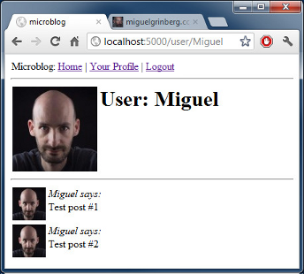
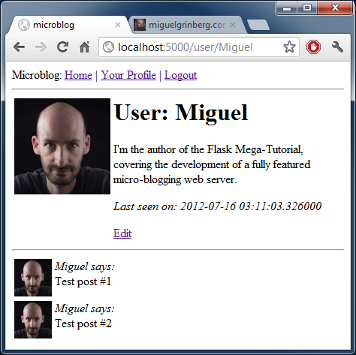

.. _profile:

用户信息页和头像
===================

回顾
---------

在上一章中，我们已经完成了登录系统，因此我们可以使用 OpenIDs 登录以及登出。

今天，我们将要完成个人信息页。首先，我们将创建用户信息页，显示用户信息以及最近的 blog。作为其中一部分，我们将会学习到显示用户头像。接着，我们将要用户 web 表单用来编辑用户信息。

用户信息页
--------------

创建一个用户信息不需要引入新的概念。我们只要创建一个新的视图函数以及与它配套的 HTML 模版。

这里就是视图函数(文件 *app/views.py*)::

    @app.route('/user/<nickname>')
    @login_required
    def user(nickname):
        user = User.query.filter_by(nickname = nickname).first()
        if user == None:
            flash('User ' + nickname + ' not found.')
            return redirect(url_for('index'))
        posts = [
            { 'author': user, 'body': 'Test post #1' },
            { 'author': user, 'body': 'Test post #2' }
        ]
        return render_template('user.html',
            user = user,
            posts = posts)

我们用于这个视图函数的装饰器与之前的有些不同。在这个例子中，我们有一个 *参数* 在里面，用 *<nickname>* 来表示。这转化为一个同名的参数添加到视图函数。当客户端以 URL */user/miguel* 请求的时候，视图函数收到一个 *nickname = 'miguel'* 参数而被调用。

视图函数的实现没有让人惊喜的。首先，我们使用接收到参数 *nickname* 试着从数据库载入用户。如果没有找到用户的话，我们将会抛出错误信息，重定向到主页。

一旦我们找到用户，我们把它传入到 *render_template* 调用， 并且传入一些伪造的 blog。注意在用户信息页上只会显示该用户的 blog，因此，我们伪造的 blog 的 *author* 域必须正确。

我们最初的视图模版是十分简单的(文件 *app/templates/user.html*)::

    <!-- extend base layout -->
    

    
    <h1>User: {{user.nickname}}!</h1>
    

    
    

      {{post.author.nickname}} says: <b>{{post.body}}</b>
    

    
    

用户信息页现在已经完成了，但是缺少对它的链接。为了让用户很容易地检查他的或者她的信息，我们直接把用户信息页的链接放在导航栏中(文件 *app/templates/base.html*)::

   
Microblog:
        <a href="{{ url_for('index') }}">Home</a>
        
        | <a href="{{ url_for('user', nickname = g.user.nickname) }}">Your Profile</a>
        | <a href="{{ url_for('logout') }}">Logout</a>
        
    

试试应用程序吧。点击导航栏中的个人资料链接，会把你带到用户信息页。因为我们还没有到任何用户的信息页的链接，因此你必须手动键入你想要看到的用户信息的 URL。比如，你可以键入 *http://localhost:5000/user/miguel*，查看 *miguel* 用户信息。

头像
--------

我敢肯定你会同意我们的个人信息页是很无聊的。为了让他们有点更有趣，让我们添加用户头像。

不需要在我们自己的服务器处理大量的上传图片，我们依赖 `Gravatar <http://gravatar.com/>`_ 服务为我们提供用户头像。

因为返回一个头像是与用户相关的任务，我们把它放在 *User* 类(文件 *app/models.py*)::

    from hashlib import md5
    # ...
    class User(db.Model):
        # ...
        def avatar(self, size):
            return 'http://www.gravatar.com/avatar/' + md5(self.email).hexdigest() + '?d=mm&s=' + str(size)

*User* 的方法 *avatar* 返回用户图片的 URL，以像素为单位缩放成要求的尺寸。

有了 Gravatar 服务的协助，很容易处理头像。你只需要创建一个用户邮箱的 MD5 哈希，然后将其加入 URL中，像上面你看见的。在邮箱 MD5 后，你还需要提供一个定制头像尺寸的数字。*d=mm* 决定什么样的图片占位符当用户没有 Gravatar 账户。*mm* 选项将会返回一个“神秘人”图片，一个人灰色的轮廓。*s=N* 选项要求头像按照以像素为单位的给定尺寸缩放。

`Gravatar 官方文档 <https://gravatar.com/site/implement/images>`_ 对 avatar URL 有着更加详细的解释。

现在我们的 *User* 类知道怎样返回一个头像图片，我们把它融入到用户信息页的布局中(文件 *app/templates/user.html*)::

    <!-- extend base layout -->
    

    
    <table>
        <tr valign="top">
            <td></td>
            <td><h1>User: {{user.nickname}}</h1></td>
        </tr>
    </table>
    

    
    

      {{post.author.nickname}} says: <b>{{post.body}}</b>
    

    
    

*User* 类负责返回头像是一个很巧妙的事情，如果有一天决定不想要 Gravatar 头像，我们只要重构 *avatar* 返回不同的 URLs(即使指向我们自己的服务器，如果我们想要自己的头像服务器)，所有我们的模版将会自动地开始显示新的头像。

我们已经在用户信息页上添加了头像，如果我们想要在每一个 blog 前面显示头像了？这也是一个简单的工作，为了在每一个 blog 前显示头像，我们只需要在模块做一些小改变(文件 *app/templates/user.html*)::

    <!-- extend base layout -->
    

    
    <table>
        <tr valign="top">
            <td></td>
            <td><h1>User: {{user.nickname}}</h1></td>
        </tr>
    </table>
    

    
    <table>
        <tr valign="top">
            <td></td><td><i>{{post.author.nickname}} says:</i> {{post.body}}</td>
        </tr>
    </table>
    
    

这就是我们的用户资料页的样子:

在子模板中重用
-----------------

我们已经实现了用户信息页，它能够显示用户的 blog。我们的首页也应该显示任何一个用户这个时候的 blog
。这样我们有两个页需要显示用户的 blog。当然我们可以直接拷贝和复制处理渲染 blog 的模板，但这不是最理想的。因为当我们决定要修改 blog 的布局的时候，我们要更新所有使用它的模板。

相反，我们将要制作一个渲染 blog 的子模板，我们在使用它的模板中包含这个子模板。

我们创建一个 blog 的子模板，这是一个再普通不过的模板(文件 */app/templates/post.html*)::

    <table>
        <tr valign="top">
            <td></td><td><i>{{post.author.nickname}} says:</i> {{post.body}}</td>
        </tr>
    </table>

接着我们使用 Jinja2 的 *include* 命令在我们的用户模板中调用这个子模板(文件 *app/templates/user.html*)::

    <!-- extend base layout -->
    

    
    <table>
        <tr valign="top">
            <td></td>
            <td><h1>User: {{user.nickname}}</h1></td>
        </tr>
    </table>
    

    
        
    
    

一旦我们有一个功能上完全实现的首页，我们将会调用这个子模板，但是现在不准备这么做，将会把它留在后面的章节。

更多有趣的信息
------------------

尽然我们现在已经有一个不错的用户信息页，我们还有更多的信息需要在上面显示。像用户自我说明可以显示在用户信息页上，因此我们将会让用户写一些自我介绍，并将它们显示在用户资料页上。我们也将追踪每个用户访问页面的最后一次的时间，因此我们将会把它显示在用户信息页上。

为了增加这些，我们必须开始修改数据库。更具体地说，我们必须在我们的 *User* 类上增加两个字段(文件 *app/models.py*)::

    class User(db.Model):
        id = db.Column(db.Integer, primary_key = True)
        nickname = db.Column(db.String(64), unique = True)
        email = db.Column(db.String(120), index = True, unique = True)
        role = db.Column(db.SmallInteger, default = ROLE_USER)
        posts = db.relationship('Post', backref = 'author', lazy = 'dynamic')
        about_me = db.Column(db.String(140))
        last_seen = db.Column(db.DateTime)

前面的章节我们已经讲述过数据库的迁移。因此为了增加这两个新字段到数据库，需要运行升级脚本::

    ./db_migrate.py  

脚本会返回如下信息::

    New migration saved as db_repository/versions/003_migration.py
    Current database version: 3

我们的两个新字段加入到我们的数据库。记得如果在 Windows 上的话，调用脚本的方式不同。

如果我们没有迁移的支持，我们必须手动地编辑数据库，最差的方式就是删除表再重新创建。

接着，让我们修改用户信息页模板来展示这些字段(文件 *app/templates/user.html*)::

    <!-- extend base layout -->
    

    
    <table>
        <tr valign="top">
            <td></td>
            <td>
                <h1>User: {{user.nickname}}</h1>
                
{{user.about_me}}

                
<i>Last seen on: {{user.last_seen}}</i>

            </td>
        </tr>
    </table>
    

    
        
    
    

注意：我们利用 Jinja2 的条件语句来显示这些字段，因为只有当它们被设置的时候才会显示出来。

*last_seen* 字段能够被聪明地支持。记得在之前的章节中，我们创建了一个 *before_request* 函数，用来注册登录的用户到全局变量 *flask.g* 中。这个函数可以用来在数据库中更新用户最后一次的访问时间(文件 *app/views.py*)::

    from datetime import datetime
    # ...
    @app.before_request
    def before_request():
        g.user = current_user
        if g.user.is_authenticated():
            g.user.last_seen = datetime.utcnow()
            db.session.add(g.user)
            db.session.commit()

如果你登录到你的信息页，最后出现时间会显示出来。每次刷新页面，最后出现时间都会更新，因此每次浏览器在发送请求之前，*before_request* 函数都会在数据库中更新时间。

注意的是我们是以标准的 UTC 时区写入时间。我们在之前的章节中讨论过这个问题，因此我们将会以 UTC 格式写入所有时间内容以保证它们的一致性。这种时间形式在前台显示，看起来会很别扭。我们将会在后面的章节中修正这种显示问题。

要显示用户的关于我的信息，我们必须给他们输入的地方，在“编辑个人信息”页面，这是正确的地方。

编辑用户信息
----------------

新增一个用户信息表单是相当容易的。我们开始创建网页表单(文件 *app/forms.py*)::

    from flask.ext.wtf import Form, TextField, BooleanField, TextAreaField
    from flask.ext.wtf import Required, Length

    class EditForm(Form):
        nickname = TextField('nickname', validators = [Required()])
        about_me = TextAreaField('about_me', validators = [Length(min = 0, max = 140)])

接着视图模板(文件 *app/templates/edit.html*)::

    <!-- extend base layout -->
    

    
    <h1>Edit Your Profile</h1>
    <form action="" method="post" name="edit">
        {{form.hidden_tag()}}
        <table>
            <tr>
                <td>Your nickname:</td>
                <td>{{form.nickname(size = 24)}}</td>
            </tr>
            <tr>
                <td>About yourself:</td>
                <td>{{form.about_me(cols = 32, rows = 4)}}</td>
            </tr>
            <tr>
                <td></td>
                <td><input type="submit" value="Save Changes"></td>
            </tr>
        </table>
    </form>
    

最后我们编写视图函数(文件 *app/views.py*)::

    from forms import LoginForm, EditForm

    @app.route('/edit', methods = ['GET', 'POST'])
    @login_required
    def edit():
        form = EditForm()
        if form.validate_on_submit():
            g.user.nickname = form.nickname.data
            g.user.about_me = form.about_me.data
            db.session.add(g.user)
            db.session.commit()
            flash('Your changes have been saved.')
            return redirect(url_for('edit'))
        else:
            form.nickname.data = g.user.nickname
            form.about_me.data = g.user.about_me
        return render_template('edit.html',
            form = form)

为了能够让这页很容易访问到，我们在用户信息页上添加了一个链接(文件 *app/templates/user.html*)::

    <!-- extend base layout -->
    

    
    <table>
        <tr valign="top">
            <td></td>
            <td>
                <h1>User: {{user.nickname}}</h1>
                
{{user.about_me}}

                
<i>Last seen on: {{user.last_seen}}</i>

                
<a href="{{url_for('edit')}}">Edit</a>

            </td>
        </tr>
    </table>
    

    
        
    
    

编辑用户信息的链接是十分智能的，只有当用户浏览自己的用户信息页的时候才会出现，浏览其他用户的时候是不会出现的。

下面用户信息页的新的截图:

结束语
-----------

最后留给大家一个问题，应用程序存在一个 bug。这个问题在前面的章节就已经存在，这一章的代码存在同样的问题。在下一章中我会解释这个 bug，并且修正它。

如果你想要节省时间的话，你可以下载 `microblog-0.6.zip <https://github.com/miguelgrinberg/microblog/archive/v0.6.zip>`_。

请记住数据库并不包含在上述的压缩包中，请使用 *db_upgrade.py* 升级数据库，用 *db_create.py* 创建新的数据库。

我希望能在下一章继续见到各位！